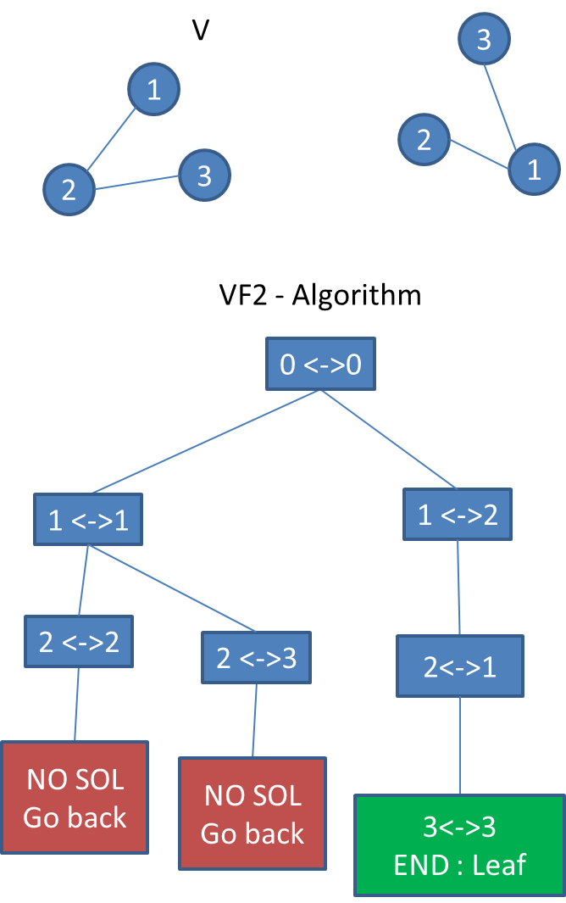
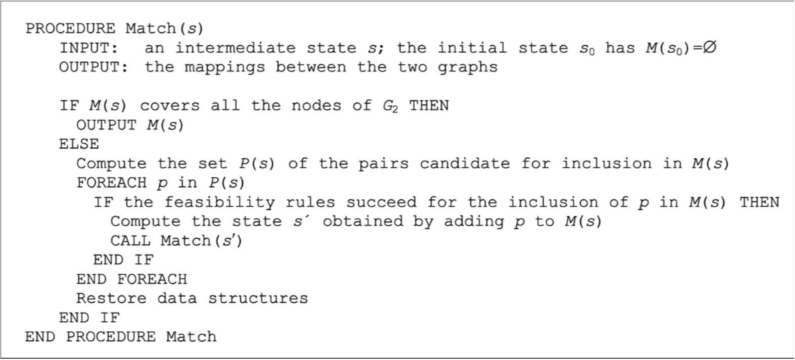
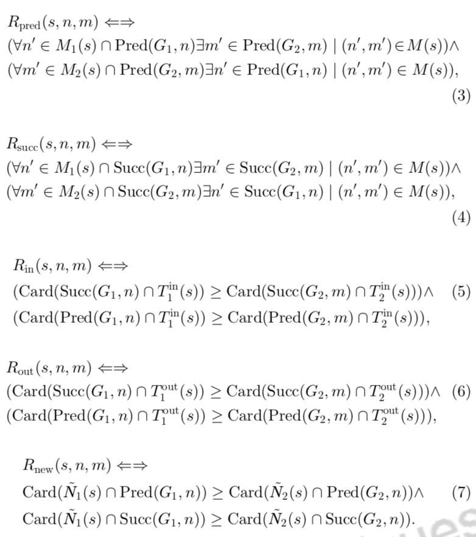
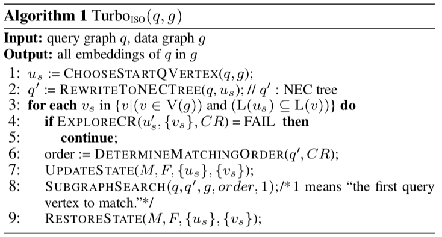
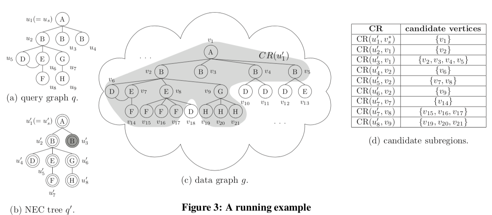
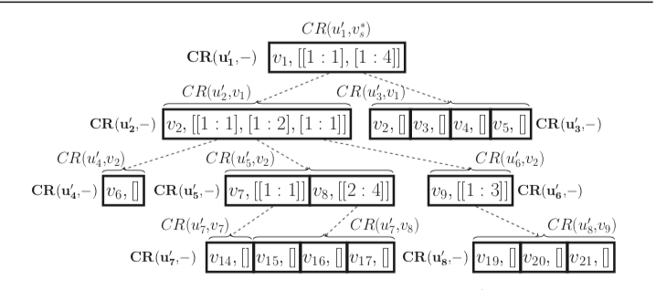
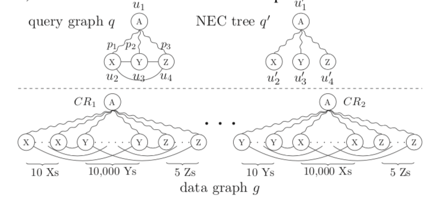
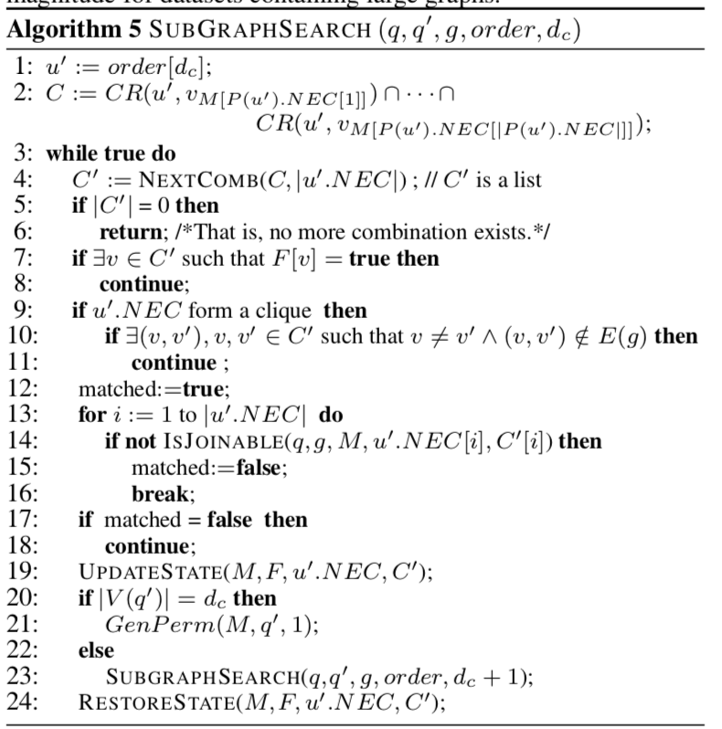

# 子图同构算法

_NP-complete Problem_

假设有图，$G = (V, E), H = (V', E')$

$G$的子图 ，$G_0 = (V_0, E_0):V_0\subset V,E_0\subset E\cup(V_0 \times V_0)$

若存在，$f: V_0 \to V', (v_1, v_2) \in E_0 \Rightarrow (f(v_1), f(v_2)) \in E'$

则，$G_0 \cong H$

## VF2

_深度优先_ _节点检查_



算法伪码



```c++
bool MatchAndNext(Vf2State &state, Bitmap *match) {
  if (state.Vf2IsGoal()) {
    match->set_bit(state.query_orig);
    return true;
  }
  if (state.Vf2IsDead()) {
    return false;
  }
  bool found = false;
  auto P = state.getCandiPairSet();
  for (auto p : P) {
    auto n = p.first;
    auto m = p.second;
    printf("P : %d %d\n", n, m);
    if (state.checkRules(n, m)) {
      Vf2State new_state(state);
      new_state.addNewPair(n, m);
      found = MatchAndNext(new_state, match);
      if (!found) {
        new_state.BackTrack();
      }
    }
  }
  return found;
}
```

;

## TurboISO

算法伪码



## StartQVertex

选出CR最小的点作为起点

$Rank(u) = \frac{freg(g, L(u))}{deg(u)}$

NLF filter: _neighborhood label frequency filter_

## NEC

简化Query，提升搜索效率

NEC: _Neighborhood Equivalence Class_



## ExploreCR

粗粒度筛选，减少无效搜索



## MatchingOrder

优化DFS顺序，提升效率



## SubgraphSearch

在之前的铺垫下，在CR中匹配出子图



```c++
NECTree *q_prime = new NECTree;
VertexId us = ChooseStartQVertex(q, g);
RewriteToNECTree(q, us, q_prime);

Bitmap *active = graph->alloc_vertex_bitmap();
Bitmap *candidates = graph->alloc_vertex_bitmap();
active->fill();
candidates->clear();

float exec_time = 0;
exec_time -= get_time();

graph->stream_vertices<VertexId>(
    [&](VertexId vtx) {
      std::cout << "vtx: " << vtx << std::endl;
      CRTree *CR = new CRTree(q_prime->getnum());
      std::vector<VertexId> VM;
      VM.push_back(vtx);

      Bitmap *visited = graph->alloc_vertex_bitmap();
      // visited->clear();
      // bool *visited = new bool[g->getgraph()->get_num_vertices()];
      // memset(visited, false,
      //        sizeof(bool) * g->getgraph()->get_num_vertices());
      bool explore = ExploreCR(q, g, 0, MAX_VID, &VM, CR, q_prime, visited);

      if (explore) {
        auto order; = new std::pair<VertexId, double>[q_prime->getnum()];
        DetermineMatchingOrder(q, 0, 1, q_prime, CR, order);

        VertexId *q_M = q->getgraph()->alloc_vertex_array<VertexId>();
        q->getgraph()->fill_vertex_array<VertexId>(q_M, MAX_VID);

        Bitmap *g_F = g->getgraph()->alloc_vertex_bitmap();
        g_F->clear();

        auto *q_V = new std::vector<VertexId>;
        auto *g_V = new std::vector<VertexId>;
        q_V->push_back(us);
        g_V->push_back(vtx);

        UpdateState(q_M, g_F, q_V, g_V);

        SubgraphSearch(q, g, q_prime, order, 1, q_M, g_F, CR);

        RestoreState(q_M, g_F, q_V, g_V);
      }
      return 1;
    },
    candidates);
```

## VF2

_深度优先_ _节点检查_


算法伪码


```c++
bool MatchAndNext(Vf2State &state, Bitmap *match) {
  if (state.Vf2IsGoal()) {
    match->set_bit(state.query_orig);
    return true;
  }
  if (state.Vf2IsDead()) {
    return false;
  }
  bool found = false;
  auto P = state.getCandiPairSet();
  for (auto p : P) {
    auto n = p.first;
    auto m = p.second;
    printf("P : %d %d\n", n, m);
    if (state.checkRules(n, m)) {
      Vf2State new_state(state);
      new_state.addNewPair(n, m);
      found = MatchAndNext(new_state, match);
      if (!found) {
        new_state.BackTrack();
      }
    }
  }
  return found;
}
```

;

## TurboISO

算法伪码


## StartQVertex

选出CR最小的点作为起点

$Rank(u) = \frac{freg(g, L(u))}{deg(u)}$

NLF filter: _neighborhood label frequency filter_

## NEC

简化Query，提升搜索效率

NEC: _Neighborhood Equivalence Class_


## ExploreCR

粗粒度筛选，减少无效搜索


## MatchingOrder

优化DFS顺序，提升效率


## SubgraphSearch

在之前的铺垫下，在CR中匹配出子图


```c++
NECTree *q_prime = new NECTree;
VertexId us = ChooseStartQVertex(q, g);
RewriteToNECTree(q, us, q_prime);

Bitmap *active = graph->alloc_vertex_bitmap();
Bitmap *candidates = graph->alloc_vertex_bitmap();
active->fill();
candidates->clear();

float exec_time = 0;
exec_time -= get_time();

graph->stream_vertices<VertexId>(
    [&](VertexId vtx) {
      std::cout << "vtx: " << vtx << std::endl;
      CRTree *CR = new CRTree(q_prime->getnum());
      std::vector<VertexId> VM;
      VM.push_back(vtx);

      Bitmap *visited = graph->alloc_vertex_bitmap();
      // visited->clear();
      // bool *visited = new bool[g->getgraph()->get_num_vertices()];
      // memset(visited, false,
      //        sizeof(bool) * g->getgraph()->get_num_vertices());
      bool explore = ExploreCR(q, g, 0, MAX_VID, &VM, CR, q_prime, visited);

      if (explore) {
        auto order; = new std::pair<VertexId, double>[q_prime->getnum()];
        DetermineMatchingOrder(q, 0, 1, q_prime, CR, order);

        VertexId *q_M = q->getgraph()->alloc_vertex_array<VertexId>();
        q->getgraph()->fill_vertex_array<VertexId>(q_M, MAX_VID);

        Bitmap *g_F = g->getgraph()->alloc_vertex_bitmap();
        g_F->clear();

        auto *q_V = new std::vector<VertexId>;
        auto *g_V = new std::vector<VertexId>;
        q_V->push_back(us);
        g_V->push_back(vtx);

        UpdateState(q_M, g_F, q_V, g_V);

        SubgraphSearch(q, g, q_prime, order, 1, q_M, g_F, CR);

        RestoreState(q_M, g_F, q_V, g_V);
      }
      return 1;
    },
    candidates);
```
