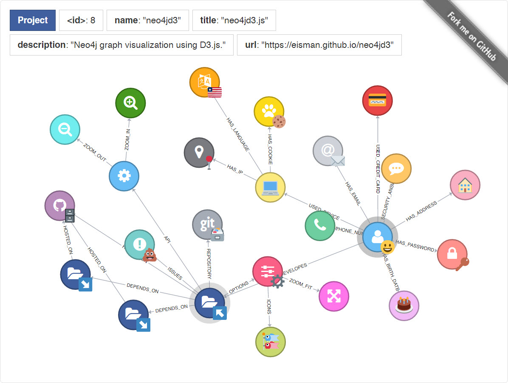
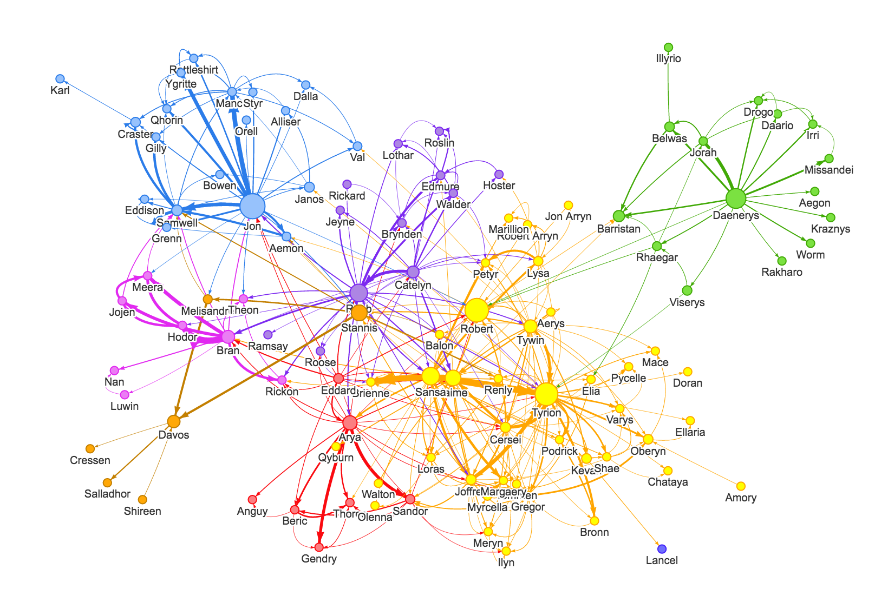

# Basic Intro

1. d3.js

  - :star: 77066
  - Github: <https://github.com/d3/d3>
  - Official : <https://d3js.org>
  - Introduce: D3.js is a JavaScript library for manipulating documents based on data. D3 helps you bring data to life using HTML, SVG, and CSS

  > 本质上可以看作是一个其他js都遵循的框架。 
  > 完全可定制化, Neo4j 就是基于d3开发的。 
  > _万物始祖_

  - Example

  <iframe width="600" height="450" src="https://bl.ocks.org/mbostock/4062045" scrolling="yes">
  </iframe>

  - 一个不错的实现 <https://github.com/eisman/neo4jd3> 

2. vis.js

  - :star: 6821
  - Github: <https://github.com/almende/vis>
  - Official : <http://visjs.org/>
  - Introduct: vis.js is a dynamic, browser-based visualization library
  - Commnet

  > 基于d3，对多节点的网络图有很强的表现力。支持JSON、DOT导入，API很强大 
  > 绘图自由度很高，能配合前端UI实现好看相衬的图 
  > _赞美之心_

  - Example

  <iframe width="600" height="450" src="http://visjs.org/examples/network/exampleApplications/nodeLegend.html" scrolling="yes">
  </iframe>

  - 一个不错的实现 <https://github.com/neo4j-contrib/neovis.js> 

3. echarts

  - :star: 28695
  - Github: <https://github.com/apache/incubator-echarts>
  - Official : <http://echarts.baidu.com/index.html>
  - Commnet

  > 百度产品，商业级，各方面都很完善，与 _Highchart_ 相当 
  > Network Graph只是特性之一，支持Gaphi，适合快速开发，UI配色也很不错 
  > Google charts 貌似没有力导向图的模块，而且其js地址被墙了,不方便 
  > Microsoft charts for asp.net

  - Example

    <iframe width="600" height="450" src="http://echarts.baidu.com/examples/editor.html?c=graph-force" frameborder="0" scrolling="yes">
    </iframe>

4. sigma.js

  - :star: 8007
  - Github: <https://github.com/jacomyal/sigma.js>
  - Official : <http://sigmajs.org>
  - Introduct: A JavaScript library dedicated to graph drawing
  - Comment

  > 以轻量著称，专注于展示多节点超大图，支持Gaphi、JSON导入 
  > 简洁高效的风格，默认是纯色系，扁平化展示效果，适合快速原型开发 
  > 与Neo4j风格差异很大，可能不太适合更深层次的用户交互

  - Example

    <iframe width="800" height="600" src="http://sigmajs.org/" scrolling="yes">
    </iframe>

  - 一个不错的实现 <https://dunnock.github.io/react-sigma/> 

5. cytoscape.js

  - :star: 4431
  - Github: <https://github.com/cytoscape/cytoscape.js>
  - Official : <http://js.cytoscape.org/>
  - Introduct: Graph theory / network library for analysis and visualisation
  - Comment

  > 支持广泛，专注于Network Graph

  > > Supports CommonJS/Node.js/Browserify/Webpack, AMD/Require.js, jQuery, npm, CDNJS, Bower, jspm, Meteor/Atmosphere, and plain JS/JavaScript 

  > 社区强大，完成度较高，给我的感觉是vis的Network Graph部分

  - Example

  <iframe width="600" height="450" src="http://js.cytoscape.org/demos/spread-layout/" frameborder="0" scrolling="yes">
  </iframe>

## Compare_Table

name          | Github_stars | Speed | Support | Beauty | Easy_code | Import     | Lience
------------- | ------------ | ----- | ------- | ------ | --------- | ---------- | ----------
d3.js         | :star: 77066 |       | 5       |        |           | Gephi/JSON | BSD-3
echarts       | :star: 28695 | 3     | 3       | 3      | 5         | Gephi      | Apache-2.0
sigma.js      | :star: 8007  | 5     |         | 4      | 4         | Gephi/JSON | MIT
vis.js        | :star: 6821  | 4     | 4       | 3      | 3         | Gephi/DOT  | Apache-2.0
cytoscape.js  | :star: 4431  | 4     | 4       | 3      | 3         | JSON       | LGPL
------------- | ------------ | ----- | ------- | ------ | --------- | ---------- | ----------
